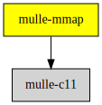

# mulle-mmap

#### 🇧🇿 Memory mapped file access

An easy to use cross-platform C memory mapping library with a MIT license.

This is based on [//github.com/mandreyel/mio](), which is a C++ header
only library. This library uses traditional `.h`/`.c` separation.
It has no shared pointer functionality.

Use Objective-C, if you need retain counts.


| Release Version                                       | Release Notes
|-------------------------------------------------------|--------------
|  [](//github.com/mulle-core/mulle-mmap/actions) | [RELEASENOTES](RELEASENOTES.md) |


### You are here




## Add

**This project is a component of the [mulle-core](//github.com/mulle-core/mulle-core) library. As such you usually will *not* add or install it
individually, unless you specifically do not want to link against
`mulle-core`.**


### Add as an individual component

Use [mulle-sde](//github.com/mulle-sde) to add mulle-mmap to your project:

``` sh
mulle-sde add github:mulle-core/mulle-mmap
```

To only add the sources of mulle-mmap with dependency
sources use [clib](https://github.com/clibs/clib):


``` sh
clib install --out src/mulle-core mulle-core/mulle-mmap
```

Add `-isystem src/mulle-core` to your `CFLAGS` and compile all the sources that were downloaded with your project.


## Install

Use [mulle-sde](//github.com/mulle-sde) to build and install mulle-mmap and all dependencies:

``` sh
mulle-sde install --prefix /usr/local \
   https://github.com/mulle-core/mulle-mmap/archive/latest.tar.gz
```

### Legacy Installation

Install the requirements:

| Requirements                                 | Description
|----------------------------------------------|-----------------------
| [mulle-c11](https://github.com/mulle-c/mulle-c11)             | 🔀 Cross-platform C compiler glue (and some cpp conveniences)

Download the latest [tar](https://github.com/mulle-core/mulle-mmap/archive/refs/tags/latest.tar.gz) or [zip](https://github.com/mulle-core/mulle-mmap/archive/refs/tags/latest.zip) archive and unpack it.

Install **mulle-mmap** into `/usr/local` with [cmake](https://cmake.org):

``` sh
cmake -B build \
      -DCMAKE_INSTALL_PREFIX=/usr/local \
      -DCMAKE_PREFIX_PATH=/usr/local \
      -DCMAKE_BUILD_TYPE=Release &&
cmake --build build --config Release &&
cmake --install build --config Release
```


## Author

[Nat!](https://mulle-kybernetik.com/weblog) for Mulle kybernetiK  


