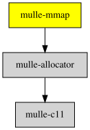

# mulle-mmap

#### 🇧🇿 Memory mapped file access

An easy to use cross-platform C memory mapping library with a MIT license.
mulle-mmap provides cross-platform memory mapping and page allocation
functionality. Map files into memory for high-performance I/O and
allocate memory pages directly from the OS.

mulle-mmap is loosely based on [mio](//github.com/mandreyel/mio), which is a
C++ header only library. This library uses traditional `.h`/`.c` separation.
It has no shared pointer functionality.

Use Objective-C, if you need retain counts.


| Release Version                                       | Release Notes  | AI Documentation
|-------------------------------------------------------|----------------|---------------
|  [](//github.com/mulle-core/mulle-mmap/actions) | [RELEASENOTES](RELEASENOTES.md) | [DeepWiki for mulle-mmap](https://deepwiki.com/mulle-core/mulle-mmap)


## API Guide

### Basic Page Allocation

```c
#include <mulle-mmap/mulle-mmap.h>

// Allocate memory pages
size_t page_size = mulle_mmap_get_system_pagesize();
void *pages = mulle_mmap_alloc_pages(page_size * 4);  // 4 pages

if (pages) {
    // Pages are zero-filled and ready to use
    memset(pages, 0xFF, page_size);  // Use the memory
    
    // Free when done
    mulle_mmap_free_pages(pages, page_size * 4);
}
```

### Shared Memory Pages

```c
// Allocate shared memory (useful for inter-process communication)
void *shared = mulle_mmap_alloc_shared_pages(page_size);

if (shared) {
    // This memory can be shared between parent and child processes
    strcpy(shared, "Hello from parent");
    
    if (fork() == 0) {
        // Child can read parent's data
        printf("Child reads: %s\n", (char*)shared);
        exit(0);
    }
    
    mulle_mmap_free_pages(shared, page_size);
}
```

### Partial Unmapping (Advanced)

```c
// Allocate 3 contiguous pages
void *pages = mulle_mmap_alloc_pages(page_size * 3);
char *page1 = (char*)pages;
char *page2 = page1 + page_size;
char *page3 = page2 + page_size;

// Use all three pages
strcpy(page1, "Page 1 data");
strcpy(page2, "Page 2 data");
strcpy(page3, "Page 3 data");

// Free only the middle page - pages 1 and 3 remain accessible!
mulle_mmap_free_pages(page2, page_size);

// Pages 1 and 3 are still usable
printf("Still accessible: %s and %s\n", page1, page3);

// Clean up remaining pages
mulle_mmap_free_pages(page1, page_size);
mulle_mmap_free_pages(page3, page_size);
```

## File Mapping

### Basic File Reading

```c
struct mulle_mmap   info;
char                *bytes;
size_t              size;

// Initialize for read-only access
_mulle_mmap_init(&info, mulle_mmap_read|mulle_mmap_no_unmap);

// Map entire file
if( mulle_mmap_map_file(&info, "data.txt") == 0)
{
    bytes = _mulle_mmap_get_bytes( &info);
    size  = _mulle_mmap_get_length( &info);
    
    // Use the mapped data (no need to read() or malloc)
    printf("File content: %.*s\n", (int) size, bytes);
    
    // Cleanup (but keeps memory alive due to `mulle_mmap_no_unmap`)
    mulle_mmap_done( &info);
}
```

### File Writing with Memory Mapping

```c
struct mulle_mmap   info;
char                *bytes;

// Initialize for read-write access
_mulle_mmap_init(&info, mulle_mmap_write);

// Map file for writing
if( mulle_mmap_map_file(&info, "output.txt") == 0)
{
    bytes = _mulle_mmap_get_bytes(&info);
    
    // Modify data directly in memory
    strcpy( bytes, "New content written via mmap");
    
    // Changes are automatically written to file on cleanup
    mulle_mmap_done( &info);
}
```

### Range Mapping

```c
struct mulle_mmap   info;
char                *bytes;

_mulle_mmap_init(&info, mulle_mmap_read);

// Map only part of a file (offset 1024, length 4096 bytes)
if( mulle_mmap_map_file_range(&info, "large_file.dat", 1024, 4096) == 0)
{
    bytes = mulle_mmap_get_bytes(&info);
    
    // Process just this portion of the file
    process_data( bytes, 4096);
    
    mulle_mmap_done( &info);
}
```


### You are here




## Add

**This project is a component of the [mulle-core](//github.com/mulle-core/mulle-core) library. As such you usually will *not* add or install it
individually, unless you specifically do not want to link against
`mulle-core`.**


### Add as an individual component

Use [mulle-sde](//github.com/mulle-sde) to add mulle-mmap to your project:

``` sh
mulle-sde add github:mulle-core/mulle-mmap
```

To only add the sources of mulle-mmap with dependency
sources use [clib](https://github.com/clibs/clib):


``` sh
clib install --out src/mulle-core mulle-core/mulle-mmap
```

Add `-isystem src/mulle-core` to your `CFLAGS` and compile all the sources that were downloaded with your project.


## Install

Use [mulle-sde](//github.com/mulle-sde) to build and install mulle-mmap and all dependencies:

``` sh
mulle-sde install --prefix /usr/local \
   https://github.com/mulle-core/mulle-mmap/archive/latest.tar.gz
```

### Legacy Installation

Install the requirements:

| Requirements                                 | Description
|----------------------------------------------|-----------------------
| [mulle-allocator](https://github.com/mulle-c/mulle-allocator)             | 🔄 Flexible C memory allocation scheme

Download the latest [tar](https://github.com/mulle-core/mulle-mmap/archive/refs/tags/latest.tar.gz) or [zip](https://github.com/mulle-core/mulle-mmap/archive/refs/tags/latest.zip) archive and unpack it.

Install **mulle-mmap** into `/usr/local` with [cmake](https://cmake.org):

``` sh
PREFIX_DIR="/usr/local"
cmake -B build                               \
      -DMULLE_SDK_PATH="${PREFIX_DIR}"       \
      -DCMAKE_INSTALL_PREFIX="${PREFIX_DIR}" \
      -DCMAKE_PREFIX_PATH="${PREFIX_DIR}"    \
      -DCMAKE_BUILD_TYPE=Release &&
cmake --build build --config Release &&
cmake --install build --config Release
```


## Author

[Nat!](https://mulle-kybernetik.com/weblog) for Mulle kybernetiK  


